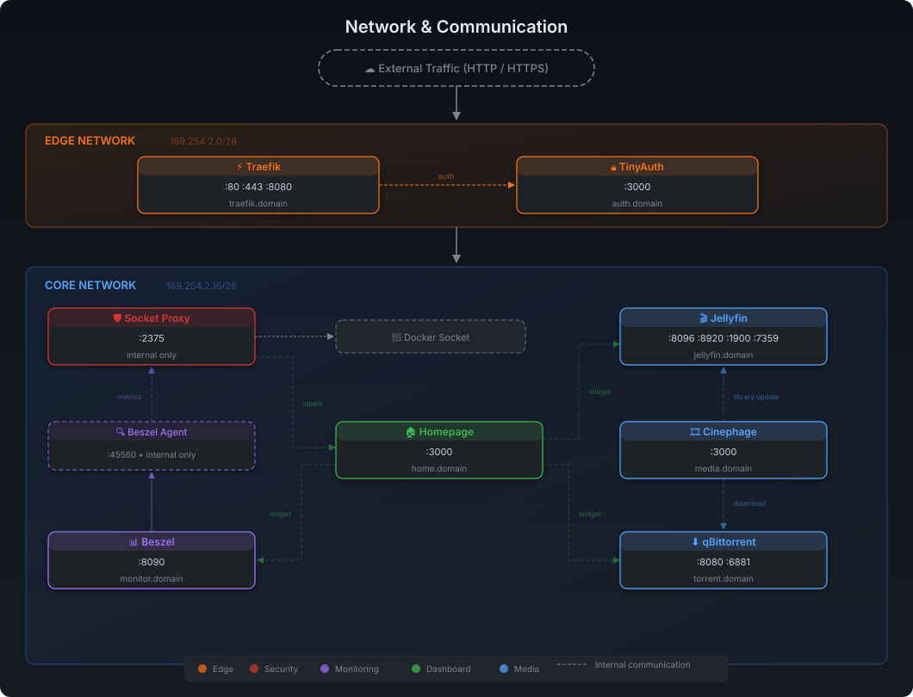

# Automated Media Server 

## Synopsis

My goal was to create a resource efficient, easily configurable, and simple solution to automate my media handling. Due to the segmentation of the well known *ARR stack i searched for alternative solutions. My goal was to achieve similar functionality, but with a much simpler solution. Most of the services uses [distroless](https://github.com/11notes/RTFM/blob/master/linux/container/image/distroless.md) and [rootless](https://github.com/11notes/RTFM/blob/master/linux/container/image/rootless.md) images to reduce the footprint of the images and enhance security.

## Network & Communication diagram



## Image references

| Service | Subdomain | Description |
|---------|-----------|-------------|
| [Socket Proxy](https://github.com/11notes/docker-socket-proxy) | — | Read-only Docker socket proxy for secure container API access |
| [Traefik](https://github.com/11notes/docker-traefik) | `traefik.DOMAIN` | Reverse proxy with automatic service discovery, TLS termination, and HTTP→HTTPS redirect |
| [TinyAuth](https://github.com/11notes/docker-tinyauth) | `auth.DOMAIN` | Lightweight forward-auth provider |
| [Homepage](https://gethomepage.dev/) | `home.DOMAIN` | Dashboard solution with service integrations |
| [Beszel](https://github.com/11notes/docker-beszel-agent) | `monitor.DOMAIN` | Lightweight monitoring solution |
| [Jellyfin](https://jellyfin.org/) | `jellyfin.DOMAIN` | Media server with transcoding capabilites on every major platform |
| [Cinephage](https://github.com/moldytaint/cinephage) | `media.DOMAIN` | Lightweight AIO media manager |
| [qBittorrent](https://github.com/11notes/docker-qbittorrent) | `torrent.DOMAIN` | Torrent client with web UI |


## Implemented best-practices

- **No direct Docker socket exposure** — all socket access goes through a read-only proxy
- **Read-only containers** - to make sure images are immutable 
- **`no-new-privileges`** - prevent container processes to get additional priviliges 
- **Forward authentication** - via TinyAuth middleware on protected routes
- **Resource limits** - (CPU and memory) on every container
- **Link-local subnets** (`169.254.x.x`) - to avoid conflicts with LAN addressing

## Suggestions

11notes documentation about how to configure docker [daemon](https://github.com/11notes/RTFM/blob/master/linux/container/docker/daemon.md) is a comprehensive guide about configuring docker properly. The repository contains a daemon.json based on this guidelines.


## Installation

## Prerequisites

Before running the setup script, make sure the following are ready.

### Required

**Docker & Docker Compose** — The host must have Docker Engine and the Compose plugin installed. Verify with `docker compose version`.

**OpenSSL** — Used by the script to generate the Root CA and wildcard TLS certificates. Pre-installed on most Linux distributions.

**Local DNS** — Your router must resolve `*.DOMAIN` to the host machine's LAN IP. Without this, Traefik routing won't work. How you set this up depends on your router — most support "DNS rewrites" or "local DNS records" pointing a wildcard domain to a static IP. 

**Weather coordinates** — The Homepage weather widget needs your city name, latitude, and longitude. Get these from [Open-Meteo](https://open-meteo.com/en/docs) — search for your city, and copy the coordinates shown on the map.

**TMDB account** — Cinephage uses TMDB for media metadata. Create a free account at [themoviedb.org](https://www.themoviedb.org/), then go to Settings → API → Generate an API key. 

### Optional

**Tailscale account** — If you want to access your homelab remotely over VPN, create an account at [tailscale.com](https://tailscale.com/). The setup script can optionally install Tailscale as a subnet router, allowing your remote devices to reach all services as if they were on the local network. This is entirely optional and can be done later.

---

## The Setup Script

The `setup.sh` script handles the full initial setup in one run. It is interactive, idempotent (safe to re-run), and skips steps that have already been completed.

```bash
chmod +x setup.sh
sudo bash setup.sh
```

### What it does, step by step

**Step 1 — Generate `.env`** prompts you for the values that are unique to your environment. Everything else (image versions, port mappings, resource limits) is pre-filled with sensible defaults. The values you'll be asked for:

| Variable | Description | Example |
|----------|-------------|---------|
| `COMPOSE_PROJECT_NAME` | Docker project name | `media-server` |
| `TZ` | Timezone | `Europe/London` |
| `PUID` / `PGID` | Host user/group ID (run `id -u` / `id -g`) | `1000` / `1000` |
| `DOMAIN` | Your local domain | `home.local` |
| `DOCKER_ROOT` | Root path for all Docker data | `/mnt/storage/docker` |
| `MEDIA_ROOT` | Root path for media files | `/mnt/storage/media` |
| `HOMEPAGE_VAR_WEATHER_LABEL` | City name for the weather widget | `London` |
| `HOMEPAGE_VAR_WEATHER_LATITUDE` | Latitude from Open-Meteo | `51.5074` |
| `HOMEPAGE_VAR_WEATHER_LONGITUDE` | Longitude from Open-Meteo | `-0.1278` |
| `HOMEPAGE_VAR_LOCALE` | Language locale | `en` |
| `HOMEPAGE_VAR_UNITS` | How to display temperature units | `metric` / `imperial`|

The generated `.env` file has permissions set to `600` (owner-only read/write). Sensitive fields like passwords, API keys, and Beszel tokens are left blank for you to fill in after the respective services are configured.

**Step 2 — Create directory structure** builds the full folder tree under your `DOCKER_ROOT` and `MEDIA_ROOT`:

```
DOCKER_ROOT/
├── appdata/
│   ├── beszel/
│   ├── qbittorrent/
│   ├── jellyfin/config/
│   └── homepage/icons/    ← included in the repository
├── certs/
└── config/
    ├── homepage/          ← included in the repository
    ├── qbittorrent/
    └── cinephage/

MEDIA_ROOT/
├── movies/
├── tv/
└── downloads/
```

The `homepage/` directories under `appdata/` and `config/` are included in the repository with their configuration files and icons, so the setup script does not create them.

All directories are chowned to your configured `PUID:PGID`.

**Step 3 — Generate TLS certificates** creates a self-signed Root CA (4096-bit, valid 10 years) and a wildcard server certificate for `*.DOMAIN` (2048-bit, valid 825 days). It also writes the `certs.yml` file that Traefik uses to load the certificate. If certificates already exist, this step is skipped.

After this step, the script prints instructions for trusting the Root CA on Linux, macOS, Windows, and Android. You **must** import the CA on every device that will access your services, otherwise browsers will show certificate warnings.

**Step 4 — Create TinyAuth user** pulls the TinyAuth Docker image, then launches its interactive CLI for user creation:

```
docker run -i -t --rm ghcr.io/11notes/tinyauth:v4 user create --interactive
```

You'll be prompted for a username (email format) and password. When asked for the output format, select **"format for docker"** — this ensures the bcrypt hash has properly escaped `$` signs for use in Docker Compose environment variables. The script attempts to write the result directly into `.env` as `TINYAUTH_USERS`.

If you need additional users later, run the same command and append them comma-separated in the `.env` file.

**Step 5 — Tailscale installation (optional)** only runs if you answer "yes" when prompted. If you skip it, nothing Tailscale-related is touched. If you proceed, it will:

1. Detect your OS, network interface, and LAN subnet
2. Ask for your Tailscale auth key (generate one at [Tailscale Admin → Keys](https://login.tailscale.com/admin/settings/keys))
3. Ask you to confirm the detected LAN subnet
4. Enable IPv4/IPv6 forwarding (persisted to `/etc/sysctl.d/99-tailscale.conf`)
5. Install Tailscale via the official installer (`curl https://tailscale.com/install.sh`)
6. Start the `tailscaled` service and authenticate with your key
7. Advertise your LAN subnet so remote Tailscale clients can reach local services

After installation, you still need to do the following in the [Tailscale admin console](https://login.tailscale.com/admin/machines):

- **Approve the subnet route** on the machine's settings
- **Disable key expiry** so the node doesn't lose access after 180 days
- **Configure Split DNS** — add your router's IP as a nameserver restricted to your domain, and add a global nameserver (e.g. `1.1.1.1`) alongside it

The Tailscale installation does **not** modify your `docker-compose.yml`, `.env`, or any running containers.


## Post-Install Configuration

After running `setup.sh` and `docker compose up -d`, several services need initial configuration through their web UIs. The values generated during these steps should be copied back into `.env`, followed by `docker compose up -d` again to apply them.

### Beszel (Monitoring)

Open `https://monitor.DOMAIN` and complete the initial setup wizard. Create an admin account, then set up the system to be monitored. Once done, you'll need these values from the Beszel UI for your `.env`:

| `.env` Variable | Where to find it |
|-----------------|------------------|
| `BESZEL_USERNAME` | The admin email you created |
| `BESZEL_PASSWORD` | The admin password you chose |
| `BESZEL_SYSTEM_ID` | System settings → System ID |
| `BESZEL_AGENT_TOKEN` | Agent setup dialog → Token |
| `BESZEL_AGENT_KEY` | Agent setup dialog → Public Key |

### Jellyfin (Media Server)

Open `https://jellyfin.DOMAIN` and complete the initial setup wizard (language, admin user, media libraries). After setup:

1. Go to Dashboard → API Keys → Create a new API key
2. Copy the key into `.env` as `JELLYFIN_API_KEY`

This key is used by the Homepage widget to display Jellyfin stats on the dashboard.

### qBittorrent (Torrent Client)

Open `https://torrent.DOMAIN`. The default credentials depend on the image version — check the container logs (`docker logs qbittorrent`) for the initial password. After logging in:

1. Go to Settings → Web UI → set your preferred username and password
2. Update `QBITTORRENT_USERNAME` and `QBITTORRENT_PASSWORD` in `.env`

These credentials are used by the Homepage widget.

### Cinephage (Media Manager)

Open `https://media.DOMAIN` and configure it through the web UI.


## Applying Changes

After filling in the missing `.env` values from post-install configuration:

```bash
docker compose up -d
```
